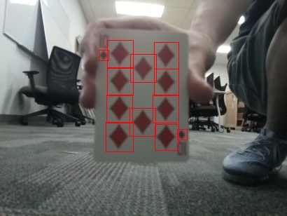

# Lab1 - Template Matching

## Introduction
This lab utilizes [OpenCV's template matching](https://docs.opencv.org/4.x/d4/dc6/tutorial_py_template_matching.html) technique to identify diamonds within playing cards. The pixel locations of bounding box for dimonds are appended to `lab1_gt.txt` <br/>


## Procedure
Install required packages
```
pip3 install -r requirements.txt 
```
Setup your input directory of images and output directory where you want to show the images and other parameters in `config.ini` file <br/><br/>

Run the program
```
python3 diamond_finder.py
```
# Contributors
Yinuo Wang, Praneeth Eddu

Jan 2022