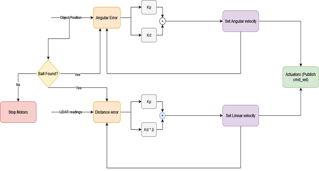

# Lab3 - Ball Tracking using PID Controllers
This is the lab3 package for Gatech ECE/CS7785.

## Introduction
This lab is an extension of object tracking lab where we integrate distance controller to maintain desired distance to an object (pink ball in our case). Depth estimation is calculated through utilization of RPLiDAR within a set Field of View. Click [here](Lab3_report.pdf) for this project's analysis. 

## Controller Model

## Configuration
* (Please add your email into `./manifest.xml` and delete this line)


## Build & Run
* Copy package into workspace
```
cp -r team_x_chase_object ${YOUR_CATKIN_WORKSPACE}/src
```
* Build the workspace
```
cd catkin_ws && catkin_make
```
* Run the launch file for simulation
```
roslaunch team_x_chase_object object_chase.launch sim:=true
```
* Run the launch file for real robot
```
roslaunch team_x_chase_object object_chase.launch
```

## Demo
